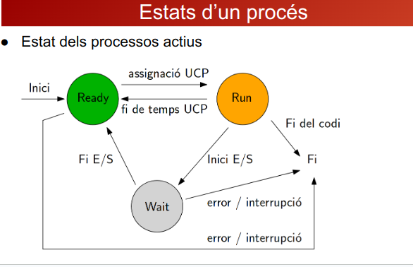

# Estado de procesos
## Introducción
La gestión de procesos implica el seguimiento y control de los distintos estados por los que pasa un proceso durante su ejecución en un sistema operativo. Estos estados representan diferentes situaciones en las que puede encontrarse un proceso, y su comprensión es esencial para optimizar la utilización de recursos del sistema. A continuación, se describen los principales estados de procesos:
## 3.1 Análisis de Estados (Listo, En Ejecución, Bloqueado)
### Listo (Ready): 
El proceso está preparado para ejecutarse, pero la CPU aún no le ha sido asignada. Se encuentra en espera en la cola de procesos listos y es elegible para ejecutarse.
### En Ejecución (Running): 
El proceso está utilizando activamente la CPU y ejecutando sus instrucciones. Solo un proceso puede estar en este estado en un momento dado.
### Bloqueado (Blocked):
 El proceso está temporalmente detenido y no puede ejecutarse. Esto puede deberse a la espera de la finalización de una operación de entrada/salida u otro evento externo. Se mueve a este estado hasta que la condición que lo bloquea se resuelve.
 ## 4.2 Transiciones Entre Estados
 Los procesos pueden experimentar transiciones entre estos estados a medida que avanzan en su ciclo de vida. Algunos ejemplos de transiciones comunes incluyen:
 ### Listo a En Ejecución:
 Ocurre cuando el planificador de procesos asigna la CPU al proceso.
 ### En Ejecución a Bloqueado
 Sucede cuando el proceso debe esperar por una operación de entrada/salida u otro evento.
 ### Bloqueado a Listo
 Ocurre cuando la condición que bloqueaba el proceso se resuelve y vuelve a ser elegible para ejecutarse.
 ### Foto
 
 ## 4.3 Ejemplos Prácticos
 Ejemplos de situaciones que podrían llevar a transiciones de estados incluyen la interacción del usuario con una aplicación que realiza operaciones intensivas de CPU, la lectura o escritura de datos en un disco, o la espera de entrada del usuario.

Comprender estos estados y transiciones es esencial para diseñar algoritmos de planificación eficientes y garantizar un uso óptimo de los recursos del sistema. En las secciones siguientes, exploraremos la sincronización y comunicación entre procesos, elementos cruciales para el funcionamiento fluido de los sistemas informáticos.